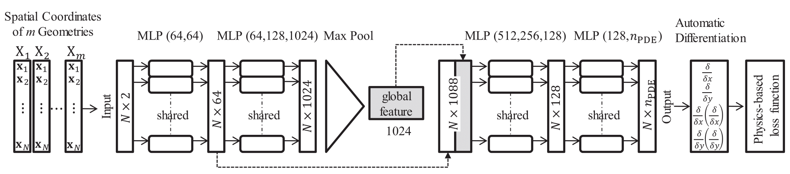
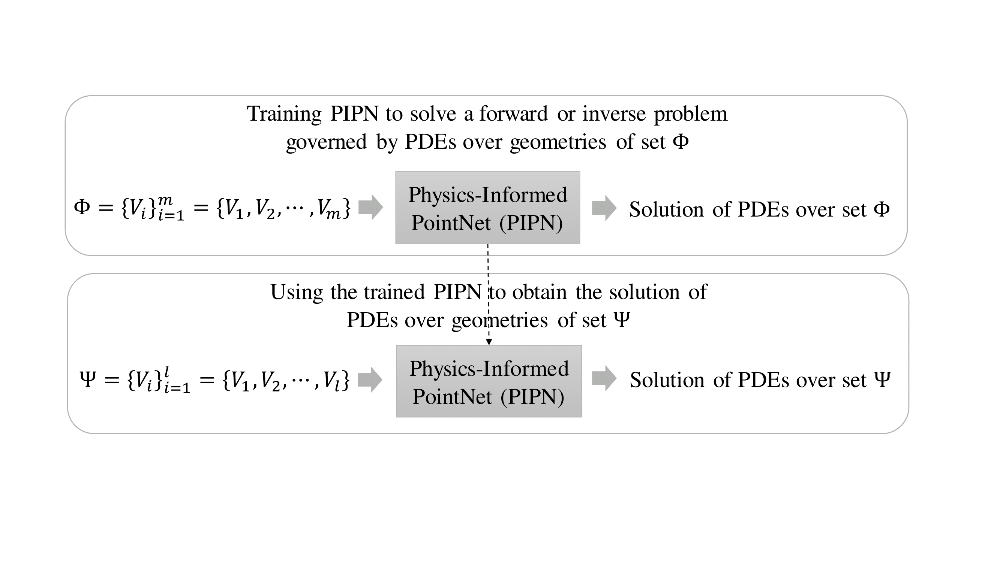
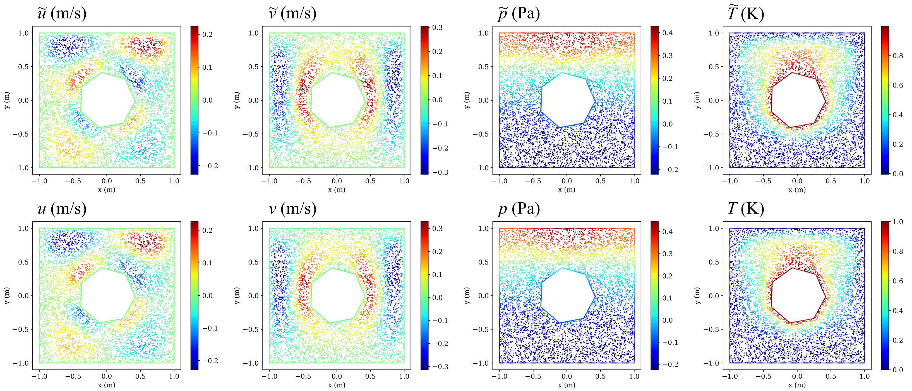
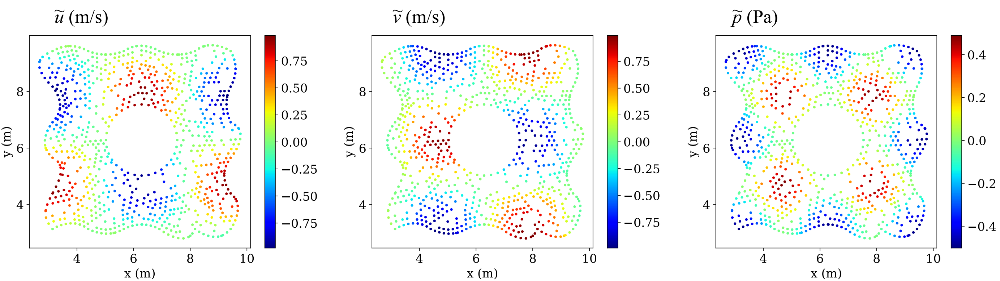

# Physics Informed PointNet (PIPN)

**Author:** Ali Kashefi (kashefi@stanford.edu) 
**Description:** Implementation of physics-informed PointNet (PIPN) for weakly-supervised learning of incompressible flows and thermal fields on irregular geometries 
**Version:** 1.0  

**Citation**  
If you use the code, plesae cite the following journal paper:  

**[Physics-informed PointNet: A deep learning solver for steady-state incompressible flows and thermal fields on multiple sets of irregular geometries](https://doi.org/10.1016/j.jcp.2022.111510)**

     @article{Kashefi2022PIPN, 
       title = {Physics-informed PointNet: A deep learning solver for steady-state incompressible flows and thermal fields on multiple sets of irregular geometries},
       journal = {Journal of Computational Physics}, 
       volume = {468}, 
       pages = {111510}, 
       year = {2022}, 
       issn = {0021-9991},
       author = {Ali Kashefi and Tapan Mukerji}}

**Abstract**  
We present a novel physics-informed deep learning framework for solving steady-state incompressible flow on multiple sets of irregular geometries by incorporating two main elements: using a point-cloud based neural network to capture geometric features of computational domains, and using the mean squared residuals of the governing partial differential equations, boundary conditions, and sparse observations as the loss function of the network to capture the physics. While the solution of the continuity and Navier-Stokes equations is a function of the geometry of the computational domain, current versions of physics-informed neural networks have no mechanism to express this functionally in their outputs, and thus are restricted to obtain the solutions only for one computational domain with each training procedure. Using the proposed framework, three new facilities become available. First, the governing equations are solvable on a set of computational domains containing irregular geometries with high variations with respect to each other but requiring training only once. Second, after training the introduced framework on the set, it is now able to predict the solutions on domains with unseen geometries from seen and unseen categories as well. The former and the latter both lead to savings in computational costs. Finally, all the advantages of the point-cloud based neural network for irregular geometries, already used for supervised learning, are transferred to the proposed physics-informed framework. The effectiveness of our framework is shown through the method of manufactured solutions and thermally-driven flow for forward and inverse problems.

**Physics-informed PointNet on Wikipedia**  
A general description of physics-informed neural networks (PINNs) and its other versions such as PIPN can be found in the following Wikipedia page: 
[Physics-informed PointNet (PIPN) for multiple sets of irregular geometries](https://en.wikipedia.org/wiki/Physics-informed_neural_networks#Physics-informed_PointNet_(PIPN)_for_multiple_sets_of_irregular_geometries)

**Physics-informed PointNet Presentation in Machine Learning + X seminar 2022 at Brown University** 
In case of your interest, you might watch the recorded machine learning seminar with the topic of PIPN at Brown University using the following link:  
[Video Presentation of PIPN at Brown University](https://www.dropbox.com/s/oafbjl6xaihotqa/GMT20220325-155140_Recording_2560x1440.mp4?dl=0)  
[YouTube Video](https://www.youtube.com/watch?v=faeHARnPSVE)

**Questions?**  
If you have any questions or need assistance, please do not hesitate to contact Ali Kashefi (kashefi@stanford.edu) via email. 

**About the Author**  
Please see the author's website: [Ali Kashefi](https://web.stanford.edu/~kashefi/) 
